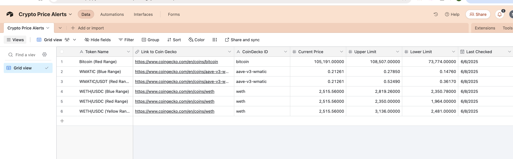
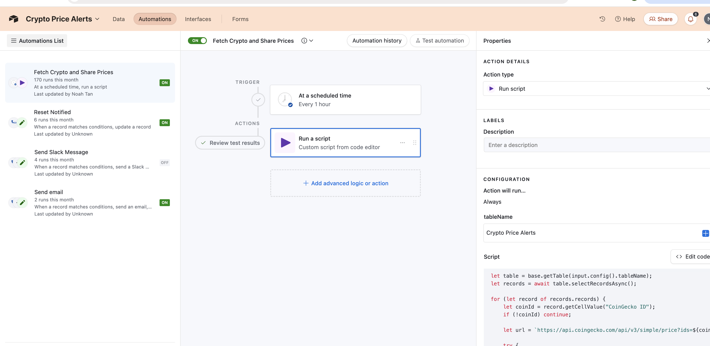
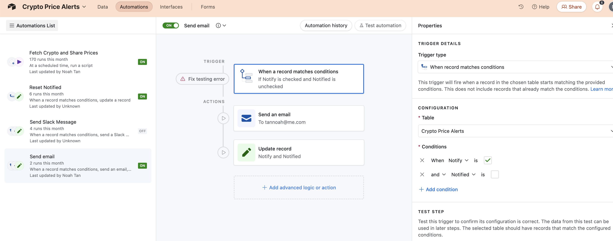
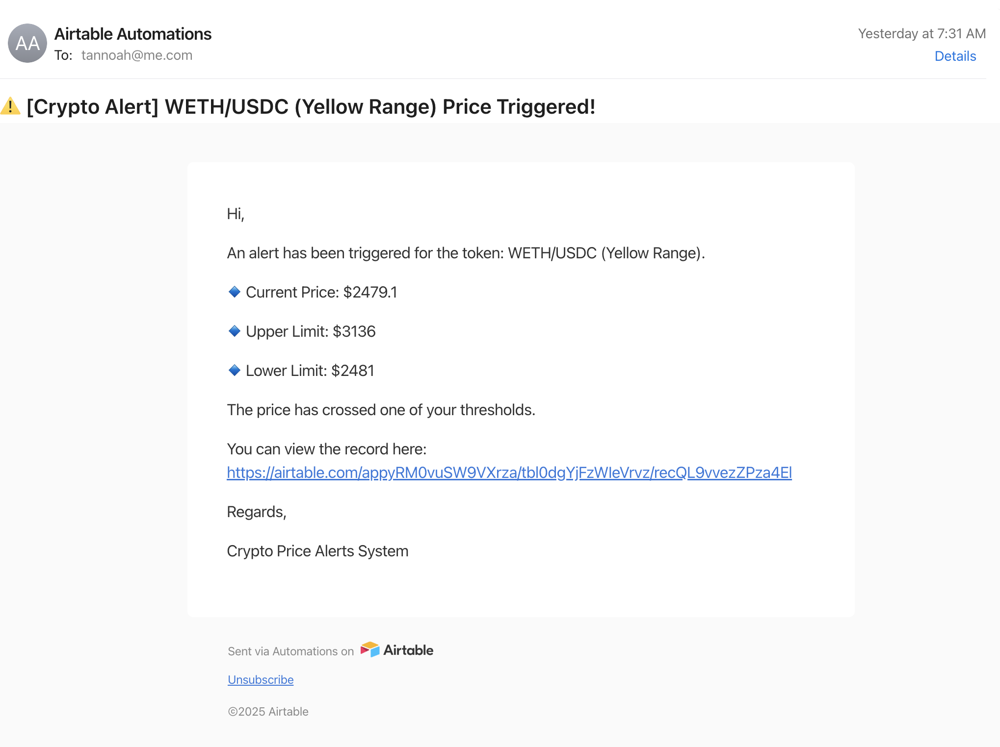
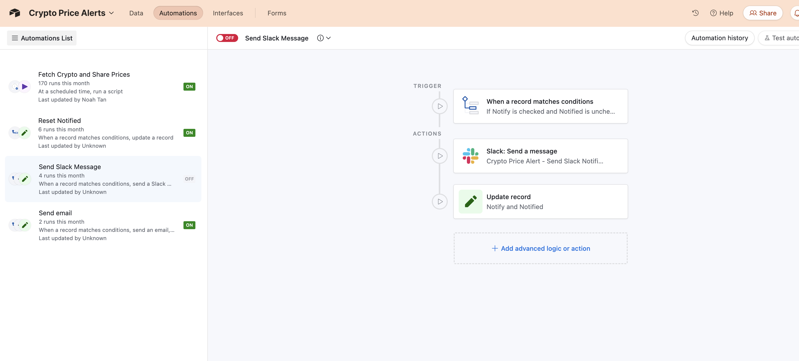

# crypto-tracker

# 📈 Crypto Price Alert System

A lightweight and efficient automated system for tracking cryptocurrency prices and sending real-time alerts when specified price thresholds are crossed. This project leverages Airtable Automations as a powerful, cost-effective, and easy-to-implement alternative to a traditional full-stack application for managing data and triggering notifications.

## ✨ Features

* **Automated Price Fetching:** Regularly fetches the latest cryptocurrency prices from a reliable external API.
* **Customizable Thresholds:** Users can set custom upper and lower price limits for each tracked token.
* **Real-time Alerts:** Sends notifications when a token's price crosses its defined upper or lower limit.
* **Multi-channel Notifications:** Supports email and Slack notifications (extensible to other platforms).
* **Easy Data Management:** Cryptocurrency tokens and their settings are managed directly within an intuitive Airtable database.
* **Notification Management:** Tracks when notifications have been sent to prevent repeated alerts.

## 💡 Why Airtable Automations? (A Full-Stack Alternative)

This project highlights Airtable Automations as a viable and powerful "backend" solution for certain use cases, offering significant advantages over building a traditional full-stack (e.g., PERN/MERN) application from scratch, particularly for prototyping or projects with simpler backend logic.

### Advantages:

* **Speed & Ease of Implementation:** Get your system up and running much faster without needing to write extensive server-side code or manage databases.
* **Cost-Effective:** Often cheaper for initial development and lower traffic scenarios as you don't need dedicated servers or complex cloud infrastructure.
* **Integrated Database & UI:** Airtable provides a visual, user-friendly interface for your data alongside its automation capabilities, simplifying data management.
* **Serverless by Nature:** No server maintenance, scaling, or uptime concerns – Airtable handles it all.
* **Accessibility:** Easier for non-developers or less technical team members to understand and even contribute to the data management and automation logic.

### Limitations (Compared to a Full-Stack App):

* **Customization:** Less flexibility and fine-grained control over logic and UI compared to custom code.
* **Scalability:** While good for many scenarios, it might face limitations for extremely high-frequency data processing or very large datasets.
* **Vendor Lock-in:** You're reliant on Airtable's platform and its features.
* **Complex Logic:** Very intricate or highly stateful application logic can become cumbersome to implement solely within Airtable scripts and automations.

This project demonstrates how Airtable can bridge the gap for applications that need backend automation and data storage without the overhead of a full custom stack, making it a great choice for quick, efficient, and practical solutions.

## ⚙️ How It Works

The system operates through a series of interconnected Airtable Automations:

1.  **Data Storage - Crypto Tokens List:**
    All cryptocurrency tokens to be tracked, along with their CoinGecko IDs, current prices, and user-defined upper/lower limits, are stored in an Airtable base.
    

2.  **Automated Price Fetching & Update:**
    A scheduled automation runs a custom JavaScript script hourly. This script iterates through the records in the Airtable table, fetches the latest price for each token from the CoinGecko API, and updates the `Current Price` field in the Airtable database. It also resets the `Notify` flag if a notification was previously sent, allowing new alerts.
    
    

3.  **Notification Triggering:**
    Separate automations are set up to trigger when a record's `Current Price` crosses either the `Upper Limit` or `Lower Limit`. These automations are conditioned to only fire if a notification hasn't been sent recently for that token (checked by a `Notify` and `Notified` field logic).
    

4.  **Multi-Channel Alerts:**
    Upon a trigger, the system can send alerts via:
    * **Email:** A detailed email notification is sent to the specified recipient, showing the token, current price, and limits.
        
    * **Slack:** An alternative automation is configured to send a message to a designated Slack channel.
        

## 🛠️ Technologies Used

* **Airtable:** For database management, automations, and custom scripting.
* **CoinGecko API:** To fetch real-time cryptocurrency price data.
* **JavaScript:** For custom logic within Airtable Automations (e.g., API calls, data manipulation).

## 🚀 Setup & Deployment

To replicate this system:

1.  **Create an Airtable Base:** Set up a new Airtable base with a table similar to the "Crypto Price Alerts" shown, including fields like "Token Name," "Link to CoinGecko," "CoinGecko ID," "Current Price," "Upper Limit," "Lower Limit," "Notify," and "Notified."
2.  **Configure Automations:**
    * Set up a scheduled automation to run the price fetching script (similar to the provided screenshot).
    * Configure trigger-based automations for email and/or Slack notifications, matching the conditions for upper/lower limit breaches and notification flags.
3.  **CoinGecko API Key:** While CoinGecko's public API is often sufficient for basic rates, be mindful of rate limits for frequent requests.

---

**Feel free to explore the code and concepts!**